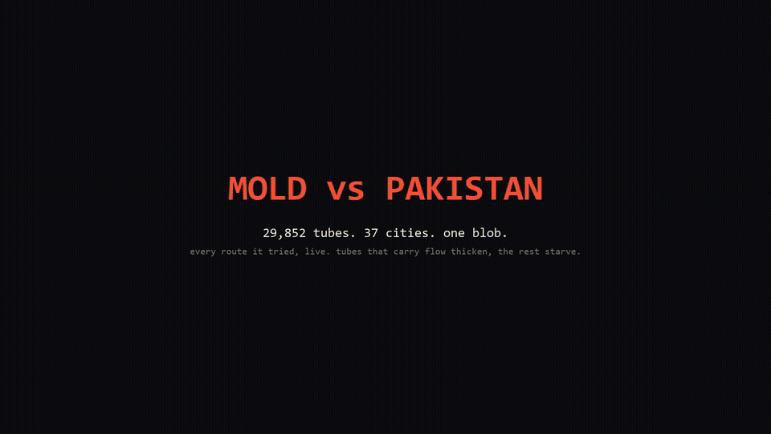
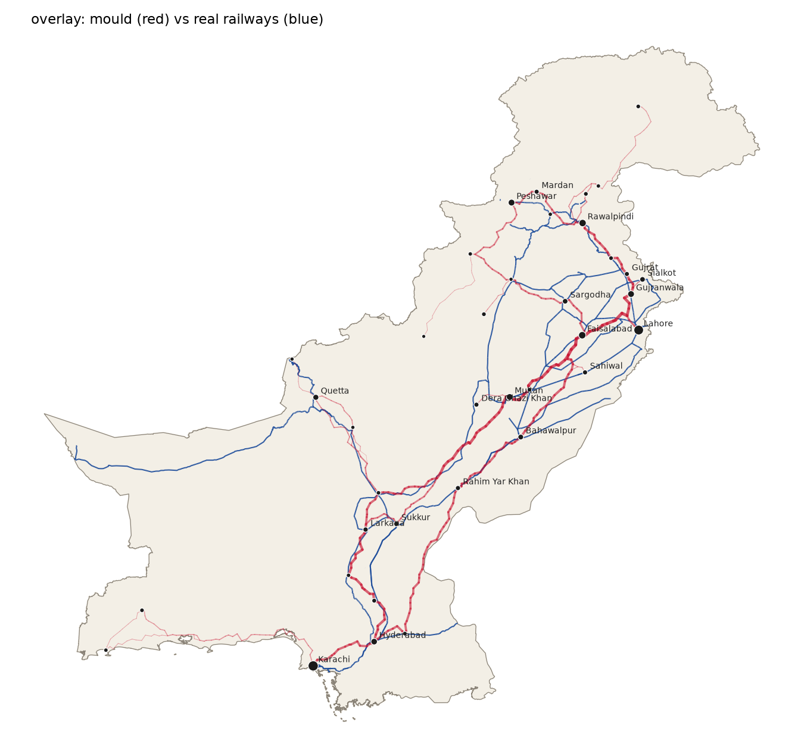

# Slime mould rail network for Pakistan



A re-run of the Tokyo slime-mould experiment (Tero et al., *Science* 2010) on
Pakistan. Cities are food sources, the land area is a lattice of tubes, and
the tubes that carry flow between cities thicken while the rest starve.

What survives is compared against the real Pakistan Railways network from
OpenStreetMap.



Red is the mould, blue is the real Pakistan Railways network. It rediscovers
the Karachi to Lahore to Peshawar trunk, the Quetta branch and the Faisalabad
loop, keeping 1.6% of its tubes.

## Run

```powershell
python -m venv .venv
.venv\Scripts\python.exe -m pip install -r requirements.txt
```

```powershell
.venv\Scripts\python.exe fetch_data.py   # boundary, elevation tiles, OSM rails (once)
.venv\Scripts\python.exe simulate.py     # ~7 min at the default 0.1 degree lattice
```

Options: `--res 0.08` for a finer lattice, `--steps 300`, `--seed 1`,
`--frame-every 5` for the GIF cadence, `--history-steps 150` for how many
steps are saved for the video renderer.

## Video

```powershell
.venv\Scripts\python.exe render_video.py --gif   # needs ffmpeg on PATH
```

Renders `out/mold_pakistan.mp4` (1080p, 30 fps, ~40 s) and a 960 px GIF:
dark background, the dead lattice left as a faint grey maze, living tubes
glowing orange to yellow with particles flowing along them, a stats panel with
a sparkline of tubes alive, plus intro and end cards. The first 20 steps get
10 frames each, steps 20 to 60 get 5, and 60 to 120 get 2, so the pruning
plays slowly where the drama is.

## Outputs (`out/`)

- `network.png`   the mould's network, tube width = conductivity
- `comparison.png` mould side by side with the real railways
- `overlay.png`   mould (red) drawn over the real railways (blue)
- `pruning.gif`   quick matplotlib animation of the flood-then-starve
- `mold_pakistan.mp4` / `.gif`  the full video from `render_video.py`
- `history.npz`   per-step conductivities and flows used by the renderer
- `stats.txt`     tube counts, lengths, and whether every city stayed connected

## How the model works

1. Jittered lattice at `--res` degrees over the country polygon, 8-neighbour
   tubes. Nodes above 4,500 m are removed.
2. Each tube's effective length is its real length times a terrain cost from
   altitude and slope. This plays the role of the light the researchers used to
   keep the mould off mountains and water.
3. Each step, for every pair of cities (weighted by sqrt of the population
   product), unit flow is pushed from one to the other. Pressures come from one
   sparse LU solve per city, pair flows by linearity.
4. Conductivity adapts: `dD/dt = f(|Q|) - D` with
   `f(Q) = (Q/Q0)^1.8 / (1 + (Q/Q0)^1.8)`. The exponent above 1 makes parallel
   routes compete and merge.
5. A tube is "starved" once `D < 0.005`.

## Inputs

- Country outline: geoBoundaries ADM0 (open licence)
- Elevation: AWS Terrain Tiles, Terrarium encoding, zoom 7
- Railways: OpenStreetMap `railway=rail` via Overpass, clipped to the border
- Cities: `cities.py`, 37 cities with approximate urban populations
